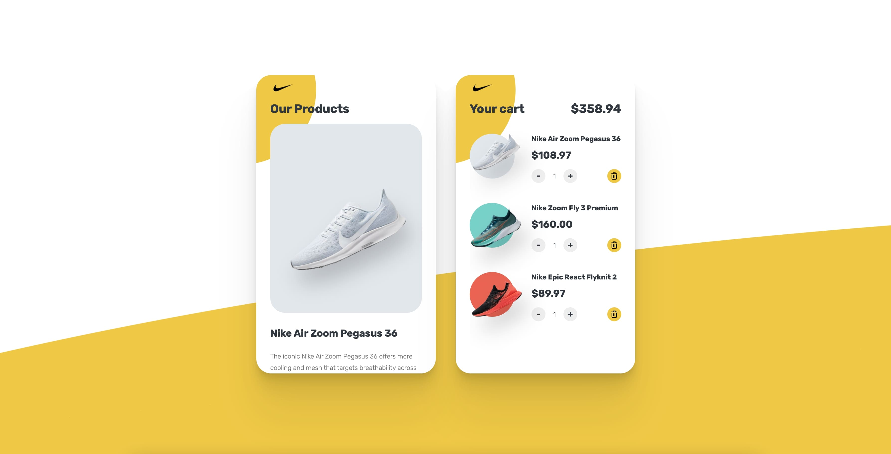

# G-Sneaker

This is the instruction for web developer intern assignment at [Golden Owl](https://goldenowl.asia). You will build a simple shopping cart.

[Live Demo](https://gshoes.vercel.app)

# Requirements

Your application should have at least features in [Must have](#must-have), things in [Nice to have](#nice-to-have) is optional (but yeah, it's attractive if you have).

### Must have:

- Display all products in `Our Products` section (for products data please check from [Technical Requirements](#technical-requirements)):
  - Single product should have name, description, price, image and `Add To Cart` button.
  - User able to click on `Add To Cart` to add target product to their cart.
  - Added product doesn't have `Add To Cart` button anymore, it should have `Check Mark Icon (✓)` instead.
- Display all added products in `Your Cart` section:
  - Each product in cart should have name, price, image, increase/decrease amount button and remove button.
  - User able to increase/decrease amount of a product in cart. When product's amount is decreased to zero, that product will be removed from cart naturally.
  - User able to remove product from cart.
  - Show total price of all products in car. When user increase/decrease product's amount or remove product, total price should be re-calculate correctly.
  - When there are no products in cart, we should show `Your cart is empty` message.
  - Products in cart should be persistent: When user visit the application, products are added before should be showed, user don't need to add products again.
- UI must follow correctly design from [live demo](https://gshoes.vercel.app).

### Nice to have:

- Responsive design (look good on all devices: desktops, tablets & mobile phones).
- Smooth animations (don't really need to be same as the demo, just do what you think is good).
- Deploy the application to heroku.

# Technical Requirements

You can use any front-end library/framework like React, Angular, Vue, ... or just simple things with HTML + CSS + Javascript (JQuery).

- Products data:
  - [`./app/data/shoes.json`](./app/data/shoes.json)
- Images & icons:
  - [`./app/assets`](./app/assets)
  - Product images are fetched directly from remote url in data
- Fonts:
  - [https://fonts.google.com/specimen/Rubik?query=Rubik](https://fonts.google.com/specimen/Rubik?query=Rubik)
- Colors:
  - `White: #FFFFFF`
  - `Black: #303841`
  - `Gray: #777777`
  - `Yellow: #F6C90E`

# Submission

After completing the assignment, please push the source code to remote repository (github/gitlab), then send us the link to your repository.

Don't forget to add `README.md` which includes guide to run your project locally and heroku demo link.

**GOOD LUCK!!!**

# Contributors

- Ben (from GO): [tranquangvu](https://github.com/tranquangvu)
